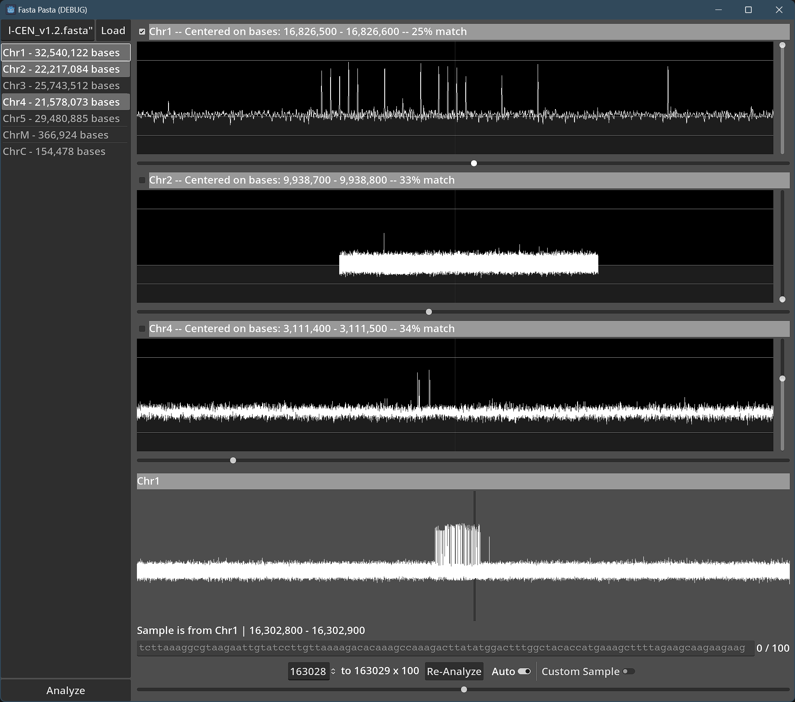

# Fasta Pasta

This is a graphical tool for analyzing short repeats in DNA sequences. It uses a compute shader running on the GPU to quickly look for matches across sequences up to 152 Mbases long.

### Recent Changes

- Scroll and pan sliders are larger and easier to grab
- Panning can now be adjusted in single increments
- Loading indicator added

## Features

- View single or multiple sections of FASTA file
- Pick any 100-length sample and get near-instant match results from 0% to 100%
- Manually enter any 100-length sample

## How to Use

1. Enter the path to your FASTA file in the top left, then press "Load" and let sit
2. When the sections of the file show up along the left, select one or more (Shift-Click or Ctrl-Click) sequences and click "Analyze"
3. You will probably need to resize the window now
4. Each loaded section is given a window which has a zoom slider to the right and a pan slider below
5. The window at the bottom is a map of the focused sequence. To change focus, click the check box at the top left of any sequence viewer window
6. Below the map is the manual sample entry box, as well as a slider that controls the location within the sequence that is being sampled. The use of these two is mutually exclusive
7. To analyze different sections, make your new selection and click "Analyze" again. The sample last used will remain in use until you select a new one

## Current Issues/Limitations

- "Load" button will load the file even if it is already loaded, and loaded files cannot be cleared except by restarting the program
- User interface is not optimized for high resolution displays
- Only supports short repeats of length 100 bases
- Cannot analyze sequences larger than 152,087,500 bases
- Viewing multiple sequences at once requires lots of vertical screen space
- Uses lots of memory

## Future Plans

- Support for analyzing arbitrarily long sequences
- Selectable short repeat length options (1000, 100, 50, 25)
- Export analysis results
- Accessibility features such as displaying the results as audio
- Low memory mode
- Sequence caching to save load times
- Cute loading animation and app icon
- Adding color to lines
